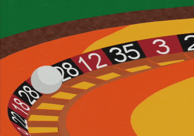

# Projeto Computacional - Little Tiger Roulette
Projeto final de CPE - Little Tiger Roulette

<p align="center">
  
</p>

## Integrantes
-Arthur Choi Braga - 242014300 <br />
-Matheus Cunha de Freitas - 242014355 <br />
-Beatriz Aguiar de Almeida - 242014319 <br />
-Felipe Hiohan de Jesus Silva - 242014391 <br />
-Larissa Julie Ferreira Lima - 242014426 <br />
-Maria Paula Vieira Ferreira - 242014382 <br />


## Descrição do projeto
O projeto consiste em fazer um simulador de roleta (Europeia) programado em C++. O usuário começa com 1000 dinheiros e pode apostar quanto quiser. O objetivo é fazer com que o usuário se divirta e se sinta em uma roleta real.

## 🛠️ Biblioteca incluídas
- `#include <iostream>` - Biblioteca base do entrada e saída do C++
- `#include <ctime>` - Biblioteca para o uso do horário do sistema para gerar números aleatórios
- `#include <cstdlib>` - Biblioteca para gerar números aleatórios
- `#include <thread>` e `#include <chrono>` - Bibliotecas para usar a função sleep() e dar um delay no programa

## ⚠️ Funções
### Girar Roleta()
```cpp	
//Função que gira a roleta (gera um número entre 0-36)
int girarRoleta() {
	return rand() % 37; // 0-36
}
```
### ehVermelho()
```cpp
//Função que retorna true se o número for vermelho ou false se for preto
bool ehVermelho(int numero) {
	const int vermelhos[] = {1,3,5,7,9,12,14,16,18,19,21,23,25,27,30,32,34,36};
	for(int i = 0; i < 18; i++) {
		if(numero == vermelhos[i]) return true;
	}
	return false;
}
```
### main()
```cpp
//Função principal
int main() {
    //Para conseguir imprimir acentuação no terminal
    setlocale(LC_ALL, "pt_BR.UTF-8");
    //Muda a 'seed' do 'rand' para o horário que o código é rodado 
	srand(time(0));
	int saldo = 1000;
    
    //Usando String Literal para imprimir o nome do jogo
	cout << R"(
            __    _ __  __  __        _______                
           / /   (_) /_/ /_/ /__     /_  __(_)___ ____  _____
          / /   / / __/ __/ / _ \     / / / / __ `/ _ \/ ___/
         / /___/ / /_/ /_/ /  __/    / / / / /_/ /  __/ /    
        /_____/_/\__/\__/_/\___/    /_/ /_/\__, /\___/_/     
            ____              __     __  _/____/             
           / __ \____  __  __/ /__  / /_/ /____              
          / /_/ / __ \/ / / / / _ \/ __/ __/ _ \
         / _, _/ /_/ / /_/ / /  __/ /_/ /_/  __/             
        /_/ |_|\____/\__,_/_/\___/\__/\__/\___/ )" << endl; 
	sleep_for(2s);
    
    //Onde o menu do jogo roda
	while(true) {
	    //Menu
		cout << "\nSaldo atual: $" << saldo << endl;
		cout << "1. Número especifico (35x)" << endl;
		cout << "2. Vermelho/Preto (2x)" << endl;
		cout << "3. Par/Impar (2x)" << endl;
		cout << "4. Sair" << endl;
		cout << "Escolha uma opção (1-4): ";
    
		char opcao;
		cin >> opcao;
		//Checka se a entrada é válida
        
        //Checkar se a opção foi válida
		if(!(opcao == '1' || opcao == '2' || opcao == '3' || opcao == '4')){
				cout << "\nOpção inválida! Digite um número(1-4)."  << endl;
				sleep_for(3s);
				continue;
		}

		int aposta, numero;
		char cor, paridade;

		// Processar os diferentes tipos de aposta
		if(opcao == '1') {
			cout << "Digite um número (0-36): ";
			//Se a entrada não for um número, ele pede para o usuário tentar novamente
			if (!(cin >> numero)){
                cout << "\nEntrada inválida! Digite um número(0-36)." << endl;
                sleep_for(3s);
                cin.clear(); 
                cin.ignore(numeric_limits<streamsize>::max(), '\n'); 
                continue;
            }
			if(numero < 0 || numero > 36) {
				cout << "\nNúmero inválido! Digite um número (0-36)." << endl;
				sleep_for(3s);
				continue;
			}
		} else if(opcao == '2') {
			cout << "Escolha (V)ermelho ou (P)reto: ";
			cin >> cor;
			if(!(cor == 'V' || cor == 'v' || cor == 'P' || cor == 'p')) {
				cout << "\nOpção inválida! Digite V ou P."  << endl;
				sleep_for(3s);
				continue;
			}
		} else if(opcao == '3') {
			cout << "Escolha (P)ar ou (I)mpar: ";
			cin >> paridade;
			if(!(paridade == 'P' || paridade == 'p' || paridade == 'I' || paridade == 'i')) {
				cout << "\nOpção inválida! Digite P ou I." << endl;
				sleep_for(3s);
				continue;
			}
		} else {
			break;
		}
        
        //Receber o valor da aposta do jogador
		cout << "Valor da aposta: $";
		if (!(cin >> aposta)){
            cout << "\nEntrada inválida! Digite um valor dentro do seu saldo de " << saldo << endl;
            sleep_for(3s);
            cin.clear(); 
            cin.ignore(numeric_limits<streamsize>::max(), '\n'); 
            continue;
        }
        
        //Checkar se esse valor recebido é válido
		if(aposta <= 0 || aposta > saldo) {
			cout << "\nValor inválido! Digite um valor dentro do seu saldo de " << saldo << endl;
			sleep_for(3s);
			continue;
		}
        
        //Deduzir o valor da aposta do saldo
		saldo -= aposta;
		//Girar a roleta e atribuir o número girado à 'resultado'
		int resultado = girarRoleta();

		// Determinar cor do resultado
		string corResultado;
		if(resultado == 0) {
			corResultado = "Verde";
		} else {
			corResultado = ehVermelho(resultado) ? "Vermelho" : "Preto";
		}

		//Imprimir a girada da roleta e a cor
		cout << "\nRoleta girando";
		sleep_for(1s);
        for (int i = 0; i < 3; i++) {
            cout << "."; 
            cout.flush();
            sleep_for(1s);
        }
        cout << endl;
        sleep_for(1s);
		cout << "[" << resultado << " " << corResultado << "]" << endl;

		bool ganhou = false;
		int multiplicador = 0;
        
        //Conferir o resultado da roleta e se o usuário ganhou
		switch(opcao) {
		case '1':
			ganhou = (resultado == numero);
			multiplicador = 35;
			break;

		case '2':
			if(resultado != 0) {
				bool vermelho = (corResultado == "Vermelho");
				ganhou = ((cor == 'V' || cor == 'v') && vermelho) ||
				         ((cor == 'P' || cor == 'p') && !vermelho);
			}
			multiplicador = 1;
			break;

		case '3':
			if(resultado != 0) {
				bool par = (resultado % 2 == 0);
				ganhou = ((paridade == 'P' || paridade == 'p') && par) ||
				         ((paridade == 'I' || paridade == 'i') && !par);
			}
			multiplicador = 1;
			break;
		}
        
        //Se ganhou, adicionando o valor ganho ao saldo
		if(ganhou) {
			int ganhos = aposta * multiplicador;
			cout << "Você ganhou! +$" << ganhos << endl;
			saldo += ganhos + aposta; // Devolve a aposta + ganhos
		} else {
			cout << "Você perdeu." << endl;
		}

		if(saldo <= 0) {
			cout << "Fim de jogo! Saldo esgotado." << endl;
			break;
		}
        
        //Jogar novamente?
		cout << "Jogar novamente? (S/N): ";
		char continuar;
		cin >> continuar;
		if (continuar == 'S' || continuar == 's'){
		    continue;
		}else if(continuar == 'N' || continuar == 'n'){
		    break;
		}else{
		    cout << "Opção inválida!" << endl;
		    sleep_for(3s);
		}
	}
    
    //Imprimir ultimas falas
    sleep_for(1s);
	cout <<"\nSaldo final: $" << saldo << endl;
	sleep_for(1s);
	cout << "Obrigado por jogar!" << endl;
	sleep_for(2s);
	return 0;
}
```

## 📝 Como usar

A utilização é bem simples, basta seguir as instruções dos menus e ir escolhendo a suas opções baseado nas instruções que ele pede.
Então, só precisa escolher os números e as letras (dependendo do caso) e o valor da aposta. O jogo irá rodar e mostrar o resultado da roleta e se você ganhou ou perdeu.

## Conclusão

Esse jogo da roleta é um aplicação simples e intuitiva que demonstra conceitos fundamentais da programação na linguagem C++.
O jogo aborda os seguintes temas: manipulação de entrada e saídas, estrutura condicional, estrutura de repetição, funções, vetores e string.

## Links

[Slides da apresentação](https://www.canva.com/design/DAGe5euFBUM/huXEXbWrD-5E15IOic7qDg/view?utm_content=DAGe5euFBUM&utm_campaign=designshare&utm_medium=link2&utm_source=uniquelinks&utlId=h388583f362)

[Vídeo de apresentação do projeto](https://youtu.be/mTbzoFQrUCg)
